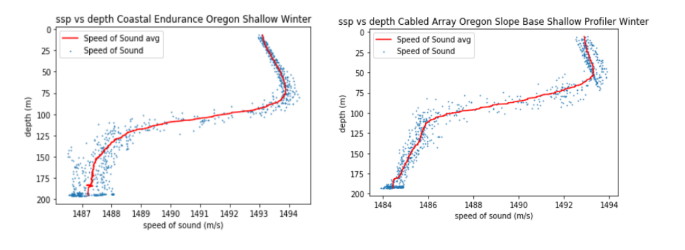

# CTD
Shan Siddiqui 
Dr. Abadi 
B ME 450 
2/14/20 

<b>CTD Project Link: https://github.com/shansiddi/CTD/blob/master/main.ipynb</b> 
  
<b>Background</b> 

Access CTD project code by clicking link - open main.ipynb in Jupyter Notebook to run code which conducts data analysis. Data for project downloaded from Ocean Observatories Initiative (OOI) [1]. CTD is a conductivity, temperature, and pressure probe which dives into the ocean while taking measurements. OOI is an open source data-set which includes a vast library of CTD data. Data for this project came from the Oregon coast from Coastal Endurance and the Cabled Array. 24 hours worth of data was chosen for download as json files in Winter and Summer for each CTD available on the two observatories. For each profiler the number of dives, speed of sound profile for each dive, as well as average speed of sound profile were computed. 

Speed of sound was calculated with the following emperical relationship.

<b>figure 0: Speed of sound equation [2]</b> 

<b>Problems</b> 

Problem 1: Compare the number of dives per day of the shallow profiler vs deep profiler
Answer 1: The shallow profiler generally ran 9 dives per day while the deep profiler would run 1 or 2. See Figure 1 for comparison of shallow and deep profiler daily operation.

<b>figure 1: Comparison between deep and shallow dives per day</b> 
  
Problem 2: Where is the maximum value of ssp in each season? Explain why the max ssp should be there?
Answer 2: The maximum speed of sound in winter and Summer occured at the deepest part of the ocean a deep dive could go. Speed of Sound is a function of depth which increases as depth increases. So, as the CTD dove deeper speed of sound kept rising. See figure 2 for graph.

<b>figure 2: Maximum speed of sound Occurs at deepest ocean depths</b> 

Problem 3: Compare the ssp profile in day ad night of all profilers, explain what you find (effect of day vs night).
Answer 3: Daytime increases the temperature of the surface, in a rough sense the ideal gas equation would indicate that density would rise as a result of the increased temperature. Speed of sound does in fact increase during daytime, but this is only visible on the shallow profilers. The shallow profilers sit near the thermocline of the local region and are therefore impacted by surface effects. The deep profilers do not make surface effects evident. See figure 3 for comparison of deep and shallow profilers speed of sound vs time.

<b>figure 3: Speed of sound vs time, shallow profilers reveal effect of day vs night. Speed of sound increases during daytime somewhat. But the pattern can not be seen on a deep profiler as it is too deep of the thermocline to be in sight. Consequently shallow profiler sees spike at lowest depth during midday while deep profiler is consistent.</b> 
  
Problem 4: Compare the ssp profile in summer and winter of all profilers, explain what you find (effect of season).
Answer 4: Hot weather increases surface temps resulting in an increased speed of sound similar to the effect of day versus night. Note the greater thermocline in the summer graph visible in figure 4. The summer surface temperatures are greater resulting not only in an increased speed of sound but also a steeper thermocline. Again as with the day and night effect the deep CTD's did not catch the thermocline, so the effect of Summer vs Winter is dampened by the wall of water above. See figure 5 to see the lack of effect driven by season in the deep CTD data.

<b>figure 4: Speed of sound variation by season - Summer increases speed of sound</b> 
  

<b>figure 5: No effect of season observable on deep dive</b> 
  
Problem 5: Compare the average ssp profiles of all profilers recorded at the same day in winter and summer (effect of location).
Answer 5: Shallow waters were not effected by location. Shallow CTD data shows an equal response for speed of sound on the coast and the deep ocean see figure 6 for the lack of an effect of location in shallow water. But the deep CTD data reveals that deep ocean can reach much higher speeds for sound than coastal CTD. Speed of sound is directly proportional to depth so the result is intuitive. See figure 7 for the vast difference between deep water and coastal ocean speed of sound profiles. 

<b>figure 6: No effect of location observable on shallow</b> 

<b>figure 7: Deeper waters able to reach much higher speeds</b> 
  
<b>Conclusions</b> 
Speed of sound is ultimately a function of density. However the density of water is a function of many variables. So, speed of sound can change with temperature, salinity, and depth (pressure). The speed of sound varies mainly as a function of temperature, but the other variables do become prominent in certain pictures. For example, in the deep water for problem 5 the difference between the coastal and deep ocean profiles was due to a variation in maximum depth. The speed of sound in the ocean water is important to marine life as sound is their primary mode of communication. In further work audio signals in the ocean will be studied for their origin.
  
References
[1] NSF Ocean Observatories Initiative Data Portal, http://ooinet.oceanobservatories.org. Downloaded on (2/14/20).

[2] K.V. Mackenzie, "Nine-term equation for sound speed in the oceans," J.Acoust. Soc. Am., vol. 70, no. 3, September 1981.
